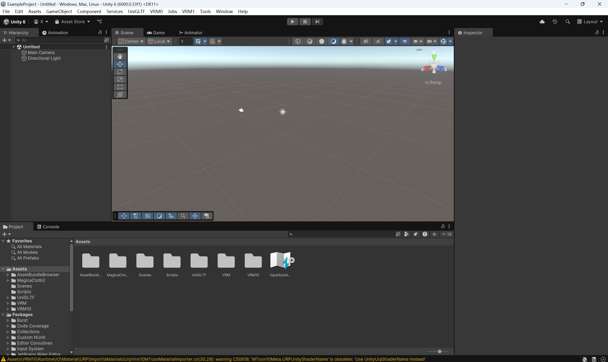
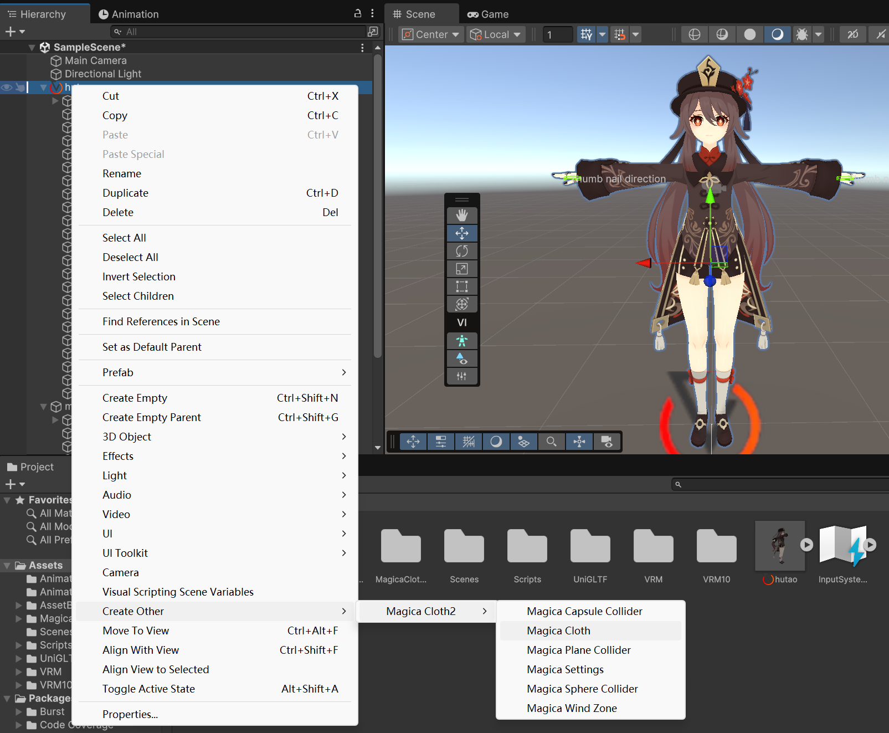

# AssetBundle decryptor for Desktop Mate
A small program for decrypting/encrypting the asset bundles of Desktop Mate. Could be used to extract resources or import custom models.
## Usage
`executable-file <path/to/AssetBundle/directory> <AssetBundleType> [isEncrypt]`
- path to AssetBundle directory - This should be `<InstallationPath>\DesktopMate_Data\StreamingAssets\AssetBundle`.
- AssetBundleType - `iltan` or `miku`
- isEncrypt - set to `E` for encrypt; otherwise decrypt.
## How to build asset bundle for custom characters
1. Get a VRM model for the target character. If you have an FBX model, you could follow [the guide](https://vrm.dev/en/vrm/how_to_make_vrm/) to build one.
2. Import the [example project](ExampleProject/) to Unity.

3. Get the animation clips for your character. You will need animations for Standing(oneShot and loop), Sitting(oneShot and loop), Dragged, Stroked(standing and sitting), Picked(standing and sitting), JumpOut, JumpIn, HideLeft, HideRight and Alarm. If the official animations fit your character well, you could extract them from the decrypted asset bundle with [AssetRipper](https://github.com/AssetRipper/AssetRipper).
	- Extract the assets with AssetRipper
	
	- The official animation clips for Miku
	
4. Import the animation clips to Unity. Create an animation controller asset (or use the corresponding official one if you are using the official animation clips). Add all the animation clips to the Base Layer of the animation controller.
	- The official animation controller asset in the asset bundle
	
	- Imported to Unity
	
5. Import your VRM model to Unity and drag it to the Scene Hierarchy. In the Animator component, select the animation controller in step 4 as controller. Attach [CharaData](ExampleProject/Assets/Scripts/CharaData.cs) to the prefab and set the arguments for animation playing. You could copy the official ones (from the CharaData MonoBehaviour extracted from the asset bundle, or by directly importing the asset bundle to Unity).
	- Select the imported animation controller in Inspector
	
	- Copy the CharaData component from the imported asset bundle (you'll need a simple Editor script to import it) to the target prefab. You might also manually add the script component and customize the arguments.
	
6. Configure MagicaCloth2 for cloth and hair physics simulating.
	1. Add MagicaCloth object for each hair or cloth component that needs physics simulation to the prefab
	
	2. Configure the MagicaCloth object. Normally we'll use BoneCloth if the target component is tied to bones. Add the root bones and select a preset (or set the parameters yourself). If the target component isn't tied to bones, use MeshCloth instead.
	
	3. Add MagicaCollider objects to the armature. Register the colliders that a certain component might collide to to the `Collider Collision` section of the corresponding MagicaCloth object.
	
	- All the configured MagicaCloth objects
	
7. Drag the prefab to assets view to save the prefab. Rename it as `iltan_prefab` or `miku_prefab` depending on which character you'd like to override. Select the saved prefab and assign it to an asset bundle (at the bottom of the Inspector window) named `iltan` or `miku`.

8. Open `Window->AssetBundle Browser` and build the asset bundle. Copy the exported asset bundle to `DesktopMate_Data\StreamingAssets\AssetBundle` of your installation path. Make sure the file name is `iltan` or `miku`. Run the decryptor with `executable-file <path/to/AssetBundle/directory> <AssetBundleType> E` to encrypt the asset bundle (remember to backup the original one).
	- Build asset bundle
	
	- The exported asset bundle
	
	- Encrypted assset bundle
	
9. Launch the game and enjoy!
	- Final effect
	
